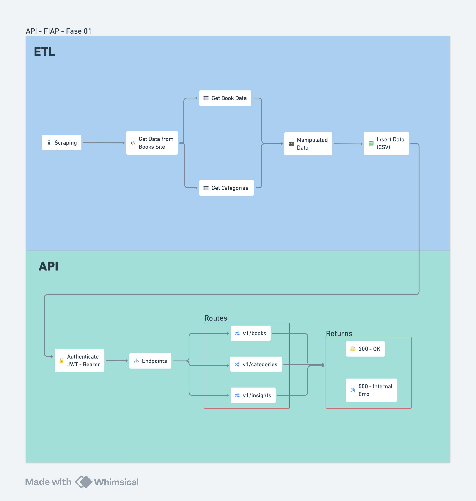

# Projeto FIAP Fase 1

## Descrição do Projeto

- Este projeto realiza scraping do site https://books.toscrape.com/, normalize os dados coletados e disponibiliza rotas REST para consultar e filtrar os livros. Foi desenvolvido para demonstrar conceitos de coleta de dados, tratamento, e exposição via API (FastAPI).

#### Principais Objetivos
- Extrair metadados dos livros (__título, categoria, imagem, avaliação, preço__).

- Armazenar e disponibilizar os dados via API.

- Autenticação via JWT para proteger endpoints sensíveis.

- Deploy em Render.


## Como Reproduzir o Projeto

### Pré-requisito
- Python -> 3.10+
- Git

### Configuração - Variáveis de Ambiente
- Crie um arquivo .env com as seguintes variaveis:

```
SECRET_KEY = "4b6f8a10e53c47a9d2f3b13f93d25a9e4c71f0d9e1a6f62c12d9f6a7b05b3c2f";
ALGORITHM = "HS256"
ADMIN_USERNAME = "admin"
ADMIN_PASSWORD = "admin"
PORT = 8000
```

### Passo a Passo para Rodar Localmente
1. Clonar o repositório:
> *git clone https://github.com/vinisouz4/FIAP_projeto_fase_1.git*

2. Acessar a pasta do projeto 
> *cd {seu-caminho}*

3. Criar um ambiente virtual 
> *python -m venv venv*
- Ativar a venv (Linux/Mac): *source venv/bin/activate*
- Ativar a venv (Windows): *venv\Scripts\activate*

4. Instale as dependências
> *pip install -r requirements.txt*

5. Rodar o projeto localmente
> *uvicorn run:app --reload*

6. Acessar o swagger
- http://localhost:8000/docs


## API
> URL API: *https://fiap-projeto-fase-1.onrender.com/docs* 

#### Autenticação
> /api/auth/login
- Usuário padrão (para testes): __admin/admin__ - apenas para teste e validação do projeto;
- O endpoint /auth/login, retorna um JWT com período de experiação determinado dentro do código;
- No Swagger UI, clique em Authorize e cole o Bearer {token}

#### Endpoints
1. __Update Data__

    >/api/scraping/v1/update_data

    - Rota para realizar a atualização do banco de dados de Books e Categories;
    
    - Todos os dados são em um banco de dados CSV dentro da estrutura de pastas do código.
    

2. __Books__
    
    > /api/v1/books
    
    - Retorna todos os livros que possui dentro do banco de dados.

    > /api/v1/categories
    
    - Retorna todas as categorias encontradas no site.

    > /api/v1/books/{book_id}

    - Retorna o livro filtrado pelo ID do mesmo.

    > /api/v1/books/search/

    - Retorna todos os livros filtrados pelo Titulo ou Categoria.

    > /api/v1/health

    - Valida se a API está ativa e retornando o status 200.

3. __Insights__

    > /api/insights/v1/stats/overview

    - Retorna os seguintes dados:

        - *total_book* -> Total de livros no banco de dados;

        - *average_price* -> Retorna o preço médio geral dos livros;

        - *rating_distribution* -> Retorna a quantidade de livros por avaliação.

    > /api/insights/v1/stats/categories

    - Retorna os seguintes dados:

        - *category* -> O nome da categoria;

        - *count_category* -> Total de livros por categoria;

        - *average_price* -> Preço médio dos livros por categoria.

    > /api/insights/v1/stats/top-rated

    - Retorna os livros com mais avaliação, gerando um ranking do mais bem avaliado até o menos avaliado.

    > /api/insights/v1/stats/price-range/{min_price}/{max_price}

    - Realiza um filtro entre um range de valor minimo até valor maximo, retornando apenas os livros dentro do range de filtros.
    
## Video Apresentação

## Diagrama de Arquitetura



